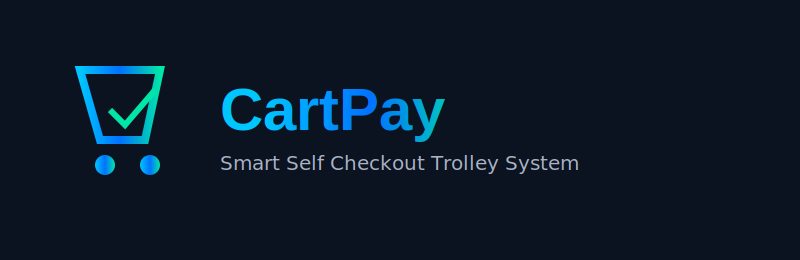

# 🛒 CartPay — Smart Self-Checkout Trolley System

<div align="center">



### 🚀 Shop. Scan. Pay. Walk Out.

*A Smart IoT-Based Self-Checkout Shopping Trolley System*


</div>

---

## 📖 Overview

CartPay is a smart IoT-based self-checkout trolley system designed to eliminate supermarket billing queues.

Customers can:
- Scan items while shopping
- Verify items using weight sensors
- Track live billing in real time
- Pay digitally or via cash kiosks
- Exit using automated RFID smart gates

---

## 🎯 Problem Statement

Traditional supermarkets face several challenges:

Long checkout queues
Billing delays during peak hours
High manpower requirements
Billing mistakes
Barcode-switching fraud
Slow cash transactions
Poor customer experience

👉 CartPay addresses these issues by transforming every trolley into a mobile checkout counter.

---

## ✨ Key Features

### 🛍 Smart Scanning
- Barcode-based item scanning  
- Instant product detection  
- Auto quantity management  
- Remove item support  

### ⚖ Weight Verification System
- Load-cell-based validation  
- Detect mismatched items  
- Anti-theft protection  

### 📱 Live Billing System
- Real-time cart total  
- Itemized bill display  
- Tax & discount support  

### ⏳ Expiry Intelligence
- Shows expiry dates  
- Near-expiry alerts  
- Discount recommendations  

### 💳 Payment System
- UPI payments  
- Card payments  
- Wallet integration  
- Cash kiosk support  

### 🚪 Smart Exit Gate
- RFID authentication  
- Auto gate opening  
- Payment verification system  

### 🗣 Voice Assistance
- Multi-language support  
- Audio alerts for items  
- Accessibility features  

### 📊 Analytics Dashboard
- Live cart tracking  
- Revenue analytics  
- Theft detection alerts  
- Inventory insights  

---

## 🏗 System Architecture

```
Customer
   │
   ▼
Smart Cart
   │
   ▼
Cloud Backend
   │
   ▼
┌───────────────────────────┐
│                           │
▼                           ▼
App Dashboard        Cash Kiosk
                           │
                           ▼
                      Exit Gate
```
---

## 🛒 Customer Workflow
```
Pick Cart
   ↓
Scan Product
   ↓
Weight Verification
   ↓
Add to Cart
   ↓
Live Bill Update
   ↓
Checkout
   ↓
Payment
   ↓
Receipt Generated
   ↓
Smart Exit Gate
   ↓
Walk Out

```

---

## 📸 Smart Trolley Design

### Components

| Component | Purpose |
|----------|--------|
| ESP32 / Raspberry Pi | Main Controller |
| Barcode Scanner | Product Scanning |
| Load Cells | Weight Verification |
| Touchscreen Display | User Interface |
| RFID Module | Cart Identification |
| Speaker | Voice Assistance |
| Battery Pack | Power Supply |

---

## ⚙ Hardware Components

| Component | Approx Cost (₹) |
|----------|----------------|
| ESP32 | 500 |
| Raspberry Pi 4 | 3500 |
| Barcode Scanner | 1500 - 3000 |
| Load Cells + HX711 | 600 - 1000 |
| Touchscreen Display | 2500 - 4500 |
| RFID Module | 200 - 500 |
| Battery Pack | 800 - 1500 |
| Speaker Module | 300 - 600 |
| Housing & Wiring | 1000 - 2000 |

---

### 💰 Estimated Prototype Cost
**₹7,400 – ₹16,600**

---

## 💻 Technology Stack

### Embedded Systems
- ESP32
- ESP-IDF
- Arduino Framework
- Raspberry Pi

### Backend
- FastAPI
- Node.js
- MQTT

### Database
- PostgreSQL
- Redis
- MongoDB

### Mobile App
- Flutter
- React Native

### Dashboard
- React.js
- Chart.js
- Recharts

### Cloud
- AWS
- Firebase

---

## 📂 Project Structure
```
CartPay/
│
├── assets/
│   ├── cartpay-logo.png
│   ├── architecture.png
│   ├── trolley-design.png
│   └── dashboard.png
│
├── firmware/
│   ├── esp32/
│   └── raspberry-pi/
│
├── backend/
│   ├── api/
│   ├── mqtt/
│   └── database/
│
├── mobile-app/
│
├── dashboard/
│
├── hardware/
│
├── docs/
│
└── README.md

```
---

## 🔌 API Endpoints

| Method | Endpoint | Description |
|--------|----------|-------------|
| POST | /session/start | Start Session |
| POST | /session/{id}/scan | Scan Item |
| DELETE | /session/{id}/item/{item_id} | Remove Item |
| GET | /session/{id}/total | Running Bill |
| POST | /session/{id}/verify-weight | Weight Check |
| POST | /session/{id}/pay/digital | Digital Payment |
| POST | /session/{id}/complete | Complete Checkout |
| GET | /alerts | Dashboard Alerts |

---

## 🔒 Security Features

- TLS Encryption  
- Device Authentication  
- RFID Validation  
- Payment Gateway Security  
- Tamper Detection  
- Secure Cloud Communication  

---

## 🚀 Development Roadmap

### Phase 1 — MVP
- Barcode Scanner  
- Weight Verification  
- Bill Generation  
- Local Backend  

### Phase 2 — Pilot Store
- Multiple Smart Carts  
- RFID Exit Gate  
- UPI Integration  
- Cash Kiosk  

### Phase 3 — Full Deployment
- ERP Integration  
- Advanced Analytics  
- Fleet Management  
- Cloud Deployment  

### Phase 4 — Future Enhancements
- AI Product Recognition  
- Computer Vision Checkout  
- Personalized Offers  
- Smart Shelf Integration  
- Indoor Navigation  
- Autonomous Smart Cart  

---

## 📊 Admin Dashboard

### Features:
- Live Cart Tracking  
- Revenue Analytics  
- Inventory Monitoring  
- Theft Detection  
- Mismatch Alerts  
- Sales Reports  

---


### 🏗 System Overview


---

### 🛒 Smart Trolley Design

(

---

### 📊 Admin Dashboard View


---

## 🤝 Contributing

- Contributions are welcome  
- Fork the repository  
- Create feature branch  
- Commit changes  
- Push branch  
- Open Pull Request  

---

## 📜 License

This project is licensed under the MIT License.

See the LICENSE file for details.

---

## 👨‍💻 Author

**Chethan Kumar**

---

## 🚀 CartPay Vision

CartPay — Smart Self-Checkout Trolley System  
Transforming Retail Through Smart Checkout Technology.

---

⭐ If you like this project, give it a star!  
🛒 Shop. Scan. Pay. Walk Out.
